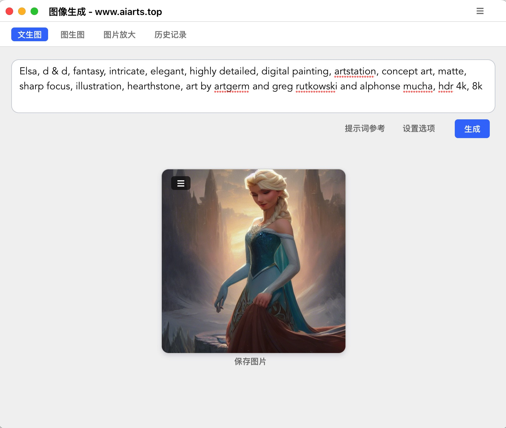
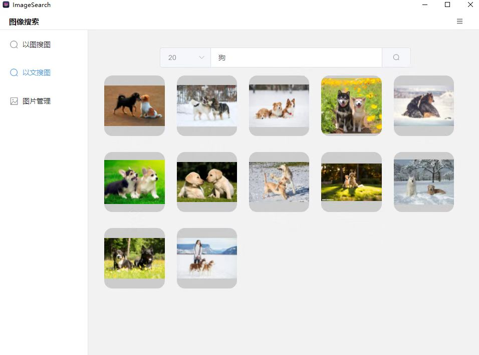
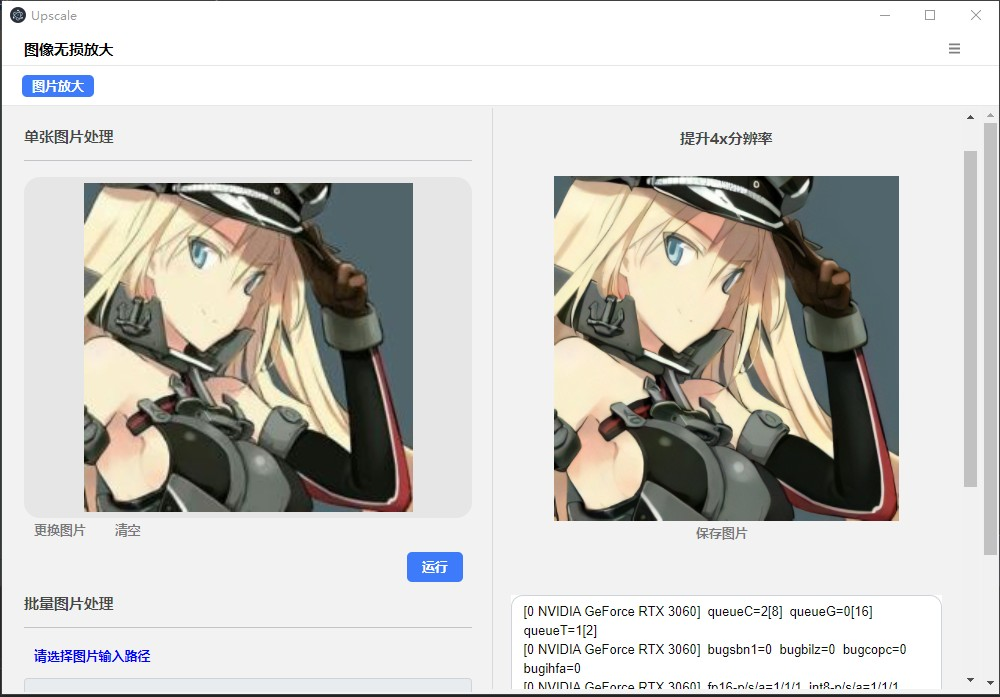
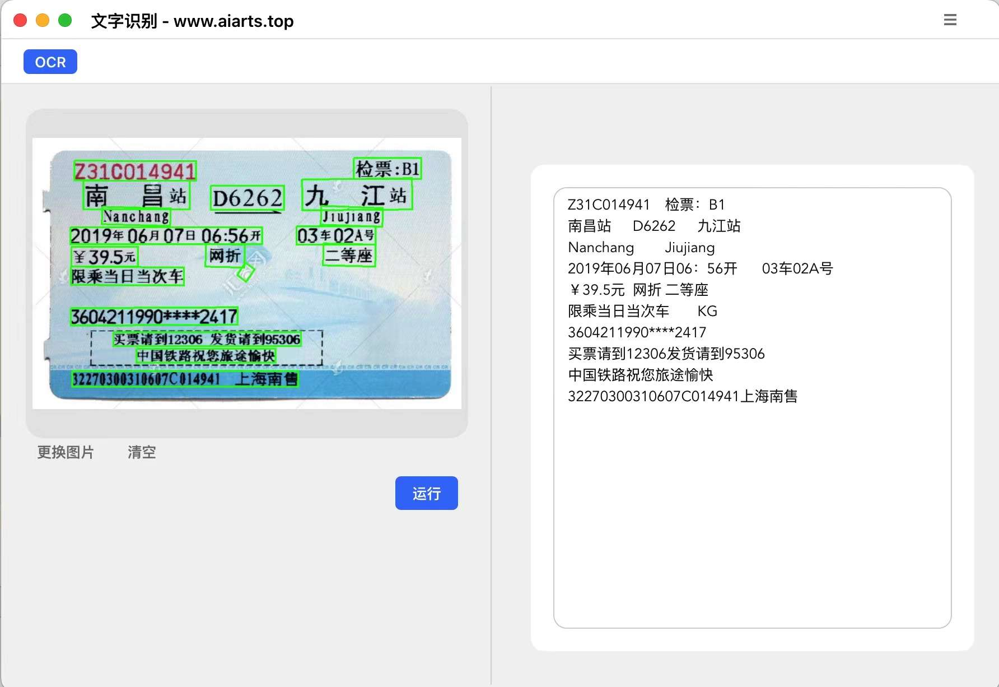

- 官网: http://www.aiarts.top/           
- Gitee:  https://gitee.com/mymagicpower/easy_AI_apps        
- GitHub: https://github.com/mymagicpower/easy_AI_apps        

### 简单易用的AI桌面工具

#### 1. 图像生成
- 文生图：输入提示词，生成图片（仅支持英文）
- 图生图：根据图片及提示词生成图片
- 图像无损放大：比如将 512*512 放大到 1024 * 1024
- 分辨率 512*512 25步 CPU(i5处理器) 5分钟。 3060显卡20秒。
- 显卡CUDA：建议11.X版本。
- [百度云盘下载](https://pan.baidu.com/s/1AGicrktOAzym6MhLCxy7nQ?pwd=61xc)

 

#### 2. 图像搜索
- 图片管理：选择图片目录，提取图片特征值
- 以图搜图：用图片搜索图片
- 以图搜图：根据文字描述搜索图片（基于图片的语义理解）
- [百度云盘下载](https://pan.baidu.com/s/1drC2hOIC0x2XVvk1Gdb8HA?pwd=2zt8)

 

<video src="assets/search.mp4" width="500"></video>

 

#### 3. 图片无损放大
- 单张图片分辨率放大
- 批量图片分辨率放大
- [百度云盘下载](https://pan.baidu.com/s/1ukxPrakYrjMYPwDWwNHZ6g?pwd=riea)

 

#### 4. OCR 文字识别
- 图片文字识别
- 图片表格识别（TODO）
- [百度云盘下载](https://pan.baidu.com/s/1Ddw0dUwAKv2A7M9CtVv8Hg?pwd=dk8b)

 

  
欢迎交流，QQ群： 166914942 

作者：Calvin    
Mail: 179209347@qq.com

  <a href="http://www.aiarts.top/">网站首页</a>

  